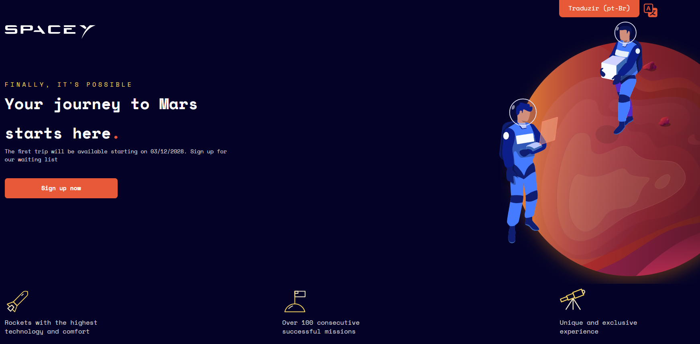
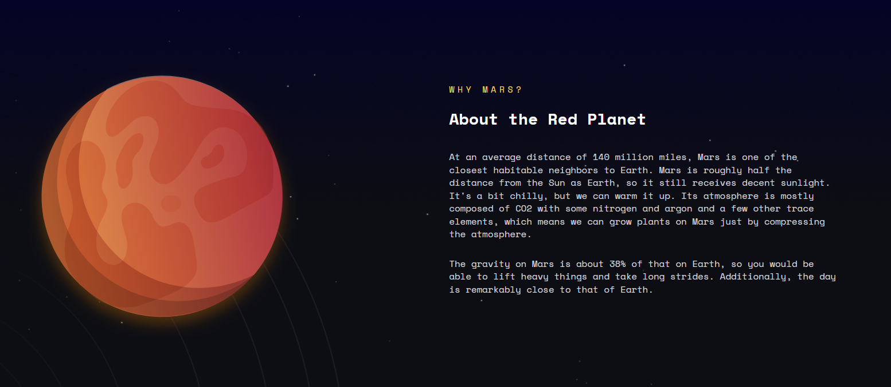
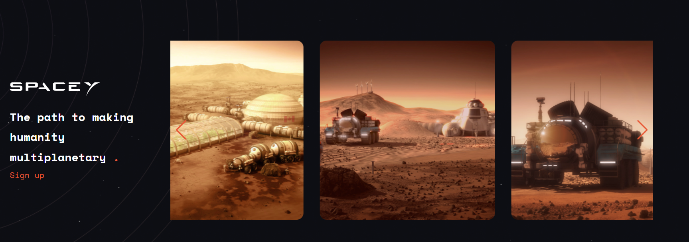
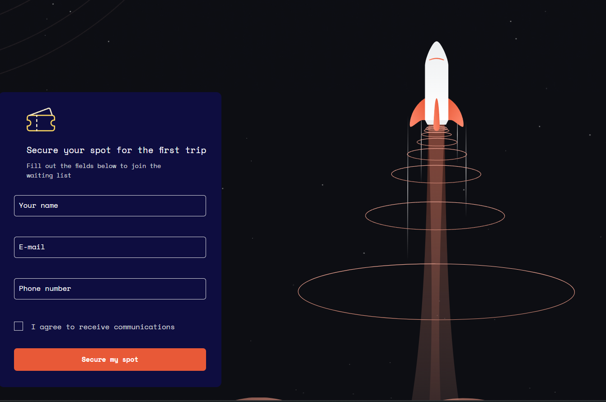
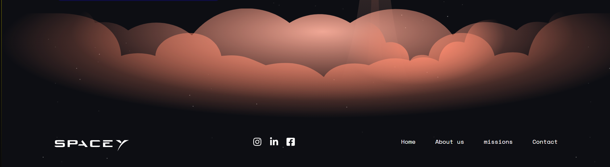

🚀Travel to Mars by Space-Y

Welcome, this is a web application developed in React that serves as a landing page to promote travel to the planet Mars. The project uses third-party libraries for styling, ensuring a modern and attractive design.

Travel to Mars by Space-Y is a frontend application developed to attract visitors with the idea of traveling to Mars. The page provides information about the date of the first trip and about the Red Planet, as well as a swiper with some images of the base on Mars. The page features a styled form for users to sign up with interest in making the trip.

This is a free design available on <a href="https://www.figma.com/design/hR0VJxJ9NzDFwwrb6pu5cv/SpaceY---Figmentor-(Community)?node-id=45-647&t=Vd0zIkSNuV3EgdGI-0">Figma Community </a>.

##

### Screenshots

